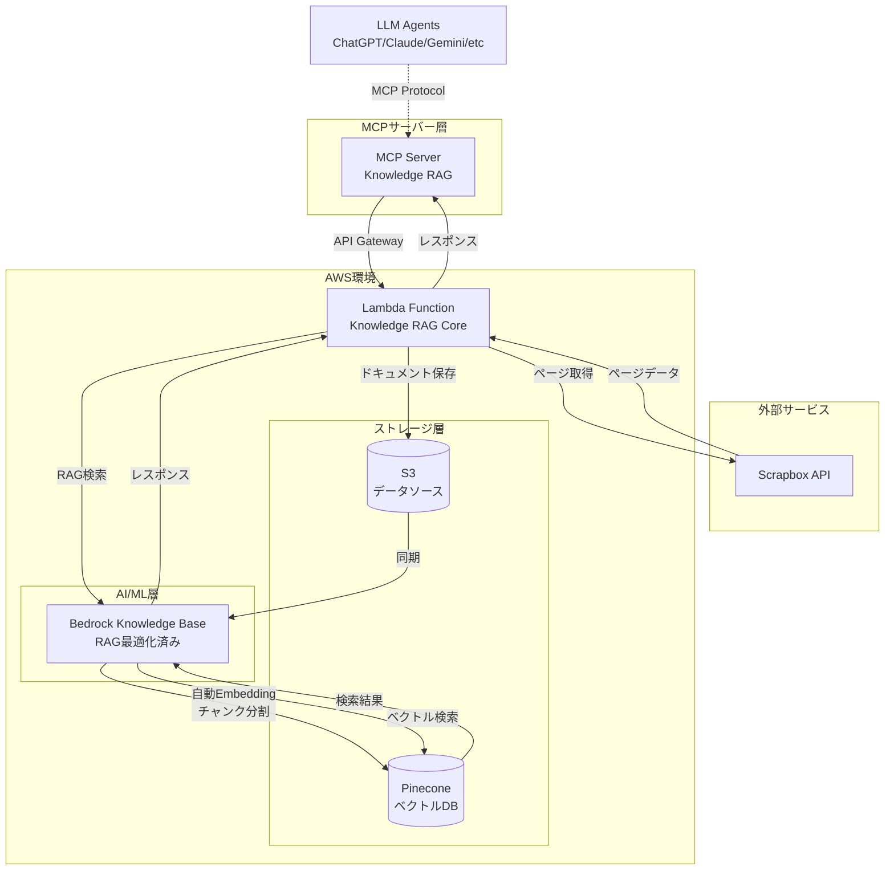
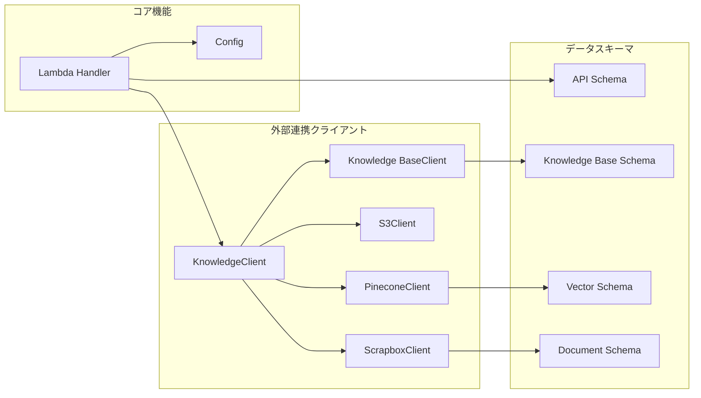
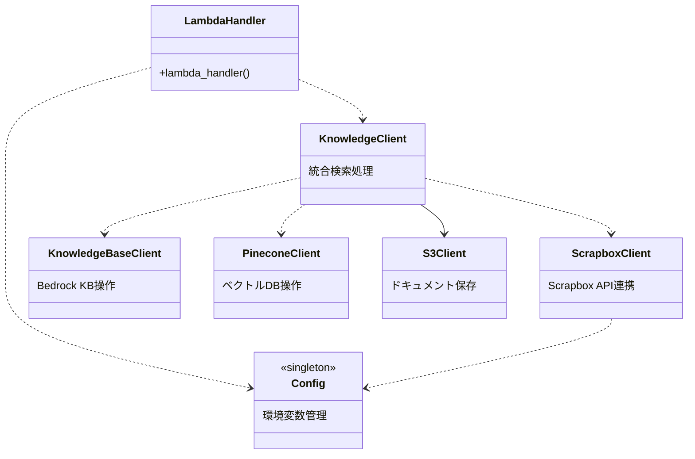
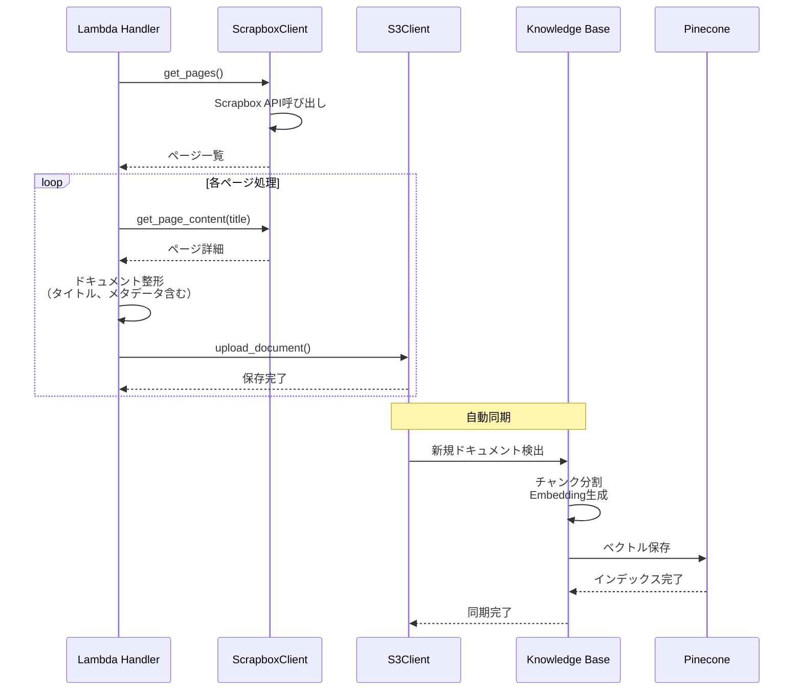
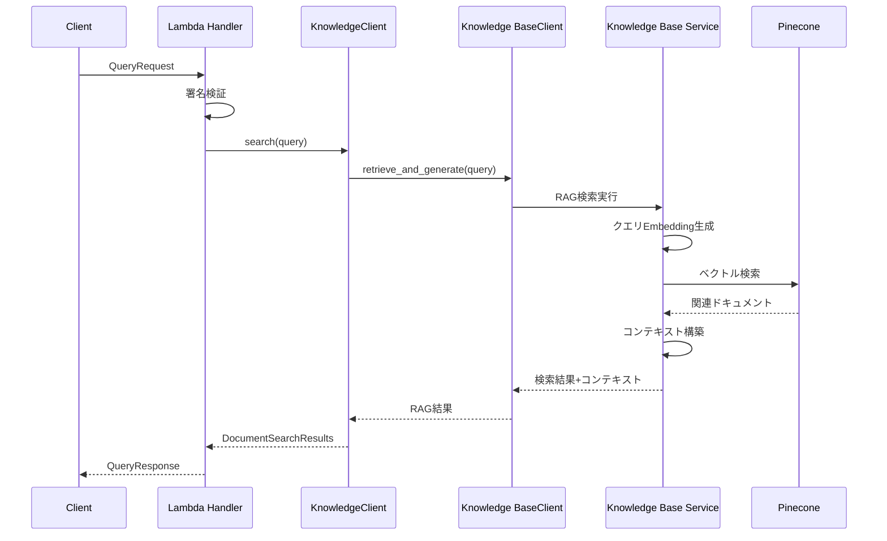
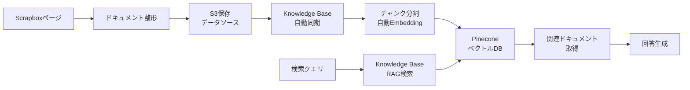

# Lambda Knowledge RAG System アーキテクチャ設計書

## 1. システム概要

### 1.1 目的

Scrapboxで管理されているナレッジベースを、ベクトル検索可能なRAG（Retrieval-Augmented Generation）システムとして構築する。AWS Lambdaを基盤として、知識の体系的な管理と高速な検索を実現する。

### 1.2 主要機能

- Scrapboxプロジェクトからの知識抽出とS3への保存
- AWS Bedrock Knowledge Baseによる自動RAGパイプライン
- ハイブリッド検索（セマンティック+キーワード）API
- 自動回答生成機能（オプション）
- MCPプロトコルによる各種LLMとの連携

## 2. システムアーキテクチャ

### 2.1 全体構成



### 2.2 主要コンポーネント



### 2.3 クラス間の依存関係



## 3. データフロー設計

### 3.1 ETL処理フロー



### 3.2 検索処理フロー



## 4. スキーマ定義

### 4.1 主要データモデル

```mermaid
classDiagram
    %% Scrapbox関連
    class ScrapboxPage {
        +id: str
        +title: str
        +updated: int
        +created: int
        +lines: int
    }
    
    class ScrapboxPageContent {
        +title: str
        +lines: list[ScrapboxLine]
        +created: int
        +updated: int
        +version: str
    }
    
    class ScrapboxLine {
        +text: str
        +indent: int
    }
    
    %% Knowledge Base関連
    class KnowledgeBaseDocument {
        +document_id: str
        +title: str
        +content: str
        +metadata: DocumentMetadata
        +s3_uri: str
    }
    
    class DocumentMetadata {
        +source: str
        +title: str
        +url: str
        +created_at: datetime
        +updated_at: datetime
        +content_type: str
    }
    
    class RAGRequest {
        +query: str
        +max_results: int = 5
        +search_type: str = "HYBRID"
    }
    
    class RAGResponse {
        +query: str
        +results: list[RetrievalResult]
        +generated_text: Optional[str]
    }
    
    class RetrievalResult {
        +document_id: str
        +title: str
        +content: str
        +score: float
        +location: dict
    }
    
    %% Pinecone関連
    class VectorData {
        +id: str
        +values: list[float]
        +metadata: VectorMetadata
    }
    
    class VectorMetadata {
        +document_id: str
        +chunk_index: int
        +source: str
        +title: str
        +content: str
        +created_at: datetime
        +updated_at: datetime
    }
    
    %% API関連
    class QueryRequest {
        +query: str
        +top_k: int = 10
        +include_generation: bool = False
    }
    
    class QueryResponse {
        +query: str
        +results: list[DocumentSearchResult]
        +total_results: int
        +generated_answer: Optional[str]
    }
    
    class DocumentSearchResult {
        +document_id: str
        +title: str
        +content: str
        +score: float
        +metadata: dict
    }
    
    %% 関連
    ScrapboxPageContent --> ScrapboxLine : contains
    KnowledgeBaseDocument --> DocumentMetadata : has
    RAGResponse --> RetrievalResult : contains
    QueryResponse --> DocumentSearchResult : contains
    VectorData --> VectorMetadata : has
```



## 5. 実装の詳細

### 5.1 データ処理方針（Knowledge Base利用）



**実装方針の利点**：

- **自動化されたRAGパイプライン**: チャンク分割からEmbedding生成まで自動
- **最適化済みの検索**: Bedrockが提供するハイブリッド検索（セマンティック+キーワード）
- **高性能ベクトルDB**: Pineconeによる高速・高精度な類似度検索
- **スケーラビリティ**: 大量ドキュメントの効率的な処理
- **メンテナンス性**: Knowledge BaseとPineconeの連携による自動化
- **回答生成機能**: 検索結果からの自動回答生成オプション

### 5.2 環境変数

| 変数名                    | 説明                      | 必須 |
|---------------------------|---------------------------|------|
| `AWS_REGION`              | AWSリージョン                  | ○    |
| `SCRAPBOX_PROJECT`        | Scrapboxプロジェクト名          | ○    |
| `SCRAPBOX_API_TOKEN`      | Scrapbox APIトークン          | ○    |
| `S3_BUCKET`               | Knowledge Base用S3バケット    | ○    |
| `KNOWLEDGE_BASE_ID`       | Bedrock Knowledge BaseのID | ○    |
| `KNOWLEDGE_BASE_ROLE_ARN` | Knowledge BaseのIAMロール     | ○    |
| `PINECONE_API_KEY`        | Pinecone APIキー            | ○    |
| `PINECONE_ENVIRONMENT`    | Pinecone環境              | ○    |
| `PINECONE_INDEX_NAME`     | Pineconeインデックス名          | ○    |

### 5.3 エラーハンドリング

```python
# HTTPエラー
- requests.HTTPError → 外部API通信エラー
- 適切なリトライとフォールバック

# 検証エラー
- pydantic.ValidationError → データ検証エラー
- 詳細なエラーメッセージ返却

# 処理エラー
- カスタム例外クラスで分類
- ログ出力とモニタリング
```

## 6. セキュリティ設計

### 6.1 認証・認可

- Lambda関数の署名検証（HMAC-SHA256）
- IAMロールによる最小権限原則
- APIトークンのSecrets Manager管理

### 6.2 データ保護

- S3暗号化（SSE-S3）
- 転送時のTLS暗号化
- ログのマスキング処理

## 7. パフォーマンス最適化

### 7.1 バッチ処理

- ページ取得の並列化
- Embedding生成のバッチ化
- ベクトルDB操作の一括処理

### 7.2 キャッシング戦略

- S3への中間結果保存
- Lambda関数のウォームスタート活用
- 接続プーリング

```mermaid
classDiagram
    %% ===== Framework / Wiring =====
    class LambdaHandler {
      +lambda_handler(event, context)
    }
    class Container {
      +search_usecase(): SearchKnowledgeUseCase
      +ingest_usecase(): IngestScrapboxUseCase
    }
    LambdaHandler --> Container

    %% ===== Application (UseCases) =====
    class SearchKnowledgeUseCase {
      +execute(query: Query, top_k: int, with_gen: bool): SearchResult
    }
    class IngestScrapboxUseCase {
      +execute(): int
    }
    Container --> SearchKnowledgeUseCase
    Container --> IngestScrapboxUseCase

    %% ===== Domain (Policies / Models) =====
    class Policies {
      +dedupe(rs: RetrievalSet): RetrievalSet
      +freshness_boost(rs: RetrievalSet): RetrievalSet
      +enforce_sources(rs: RetrievalSet): RetrievalSet
      +cap_citations(rs: RetrievalSet, n:int): RetrievalSet
      +filter_pii(rs: RetrievalSet): RetrievalSet
      +meets_threshold(rs: RetrievalSet, min_score:float): bool
    }

    class SearchMode {
      <<enumeration>>
      HYBRID
      VECTOR
      KEYWORD
    }

    class Query {
      +text: str
      +mode: SearchMode
    }
    class Chunk {
      +id: str
      +text: str
      +source: str
      +updated_at: datetime
      +score: float
      +metadata: dict
    }
    class RetrievalSet {
      +items: Chunk[]
      +snapshot_id: str
    }
    class AnswerDraft {
      +citations: Chunk[]
      +outline: str[]
    }
    class SearchResult {
      +query: str
      +results: Chunk[]
      +generated: str
      +policy_version: str
      +snapshot_id: str
    }

    SearchKnowledgeUseCase --> Policies
    SearchKnowledgeUseCase --> Query
    SearchKnowledgeUseCase --> RetrievalSet
    SearchKnowledgeUseCase --> AnswerDraft
    SearchKnowledgeUseCase --> SearchResult

    IngestScrapboxUseCase --> Chunk

    %% ===== Ports (Interfaces) =====
    class ScrapboxPort {
      <<interface>>
      +list_pages(): dict[]
      +get_page(title:str): dict
    }
    class StorePort {
      <<interface>>
      +put(key:str, content: bytes, metadata: dict): void
    }
    class RetrieverPort {
      <<interface>>
      +retrieve(query: Query, top_k:int, mode: SearchMode): RetrievalSet
    }
    class GeneratorPort {
      <<interface>>
      +generate(query: Query, citations: Chunk[]): str
    }

    SearchKnowledgeUseCase ..> RetrieverPort
    SearchKnowledgeUseCase ..> GeneratorPort
    IngestScrapboxUseCase ..> ScrapboxPort
    IngestScrapboxUseCase ..> StorePort

    %% ===== Adapters (Implementations) =====
    class ScrapboxClient {
      -cfg: Config
    }
    class S3Store {
      -cfg: Config
    }
    class BedrockKbClient {
      -cfg: Config
    }
    class LlmClient {
      -cfg: Config
    }

    ScrapboxClient ..|> ScrapboxPort
    S3Store ..|> StorePort
    BedrockKbClient ..|> RetrieverPort
    LlmClient ..|> GeneratorPort

    %% ===== Shared =====
    class Config {
      +from_env(): Config
      +aws_region: str
      +scrapbox_project: str
      +s3_bucket: str
      +kb_id: str
    }

    ScrapboxClient --> Config
    S3Store --> Config
    BedrockKbClient --> Config
    LlmClient --> Config
    Container --> Config
```


