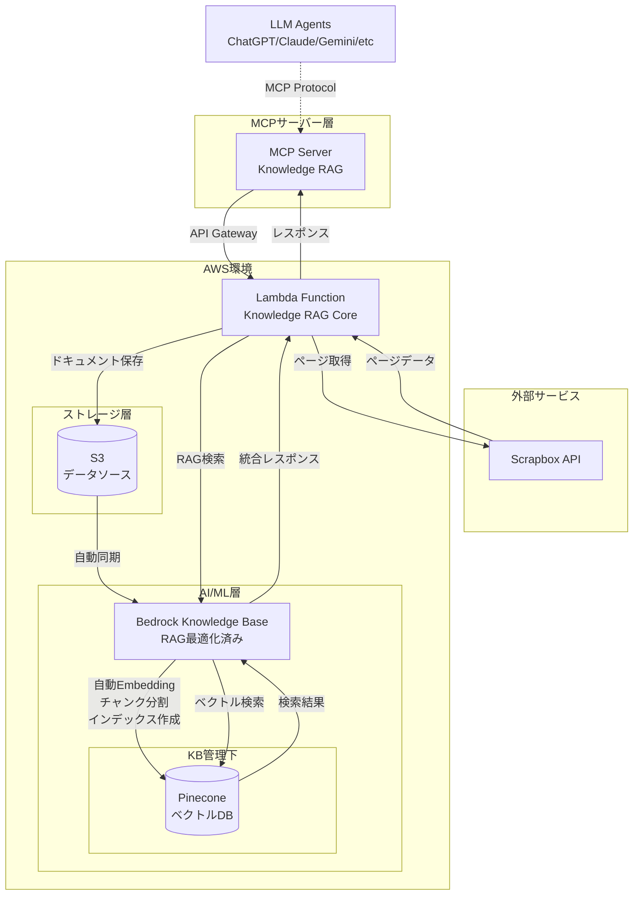
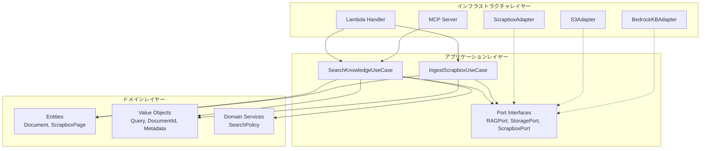
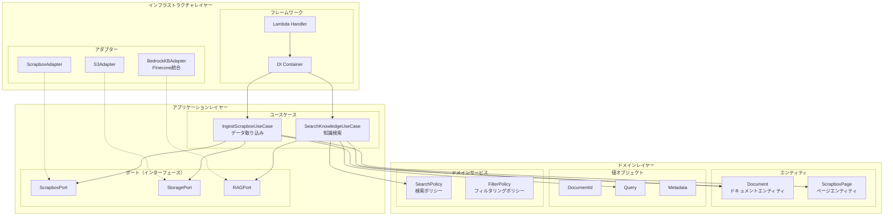
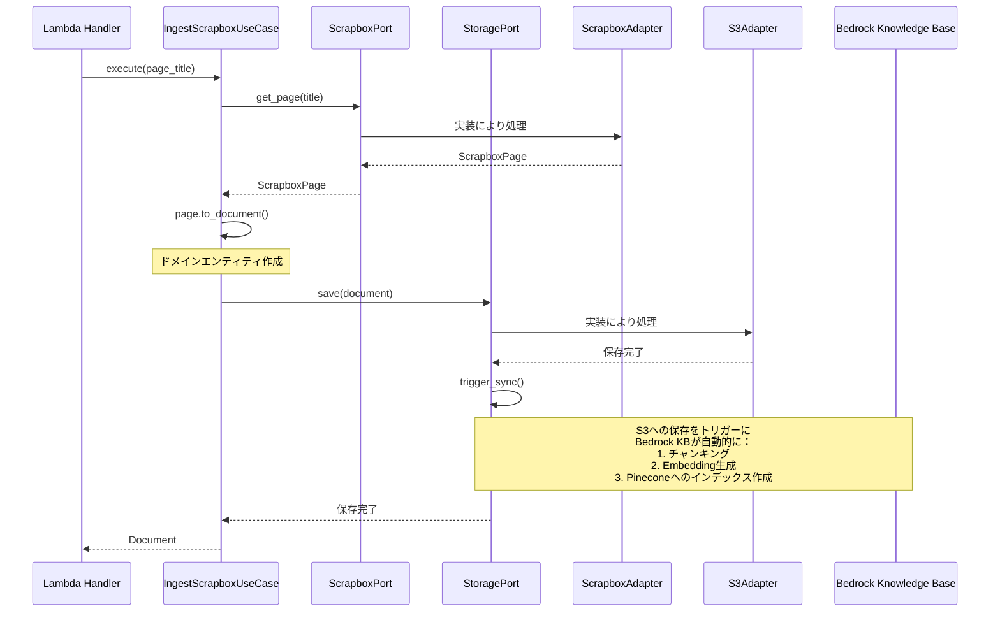
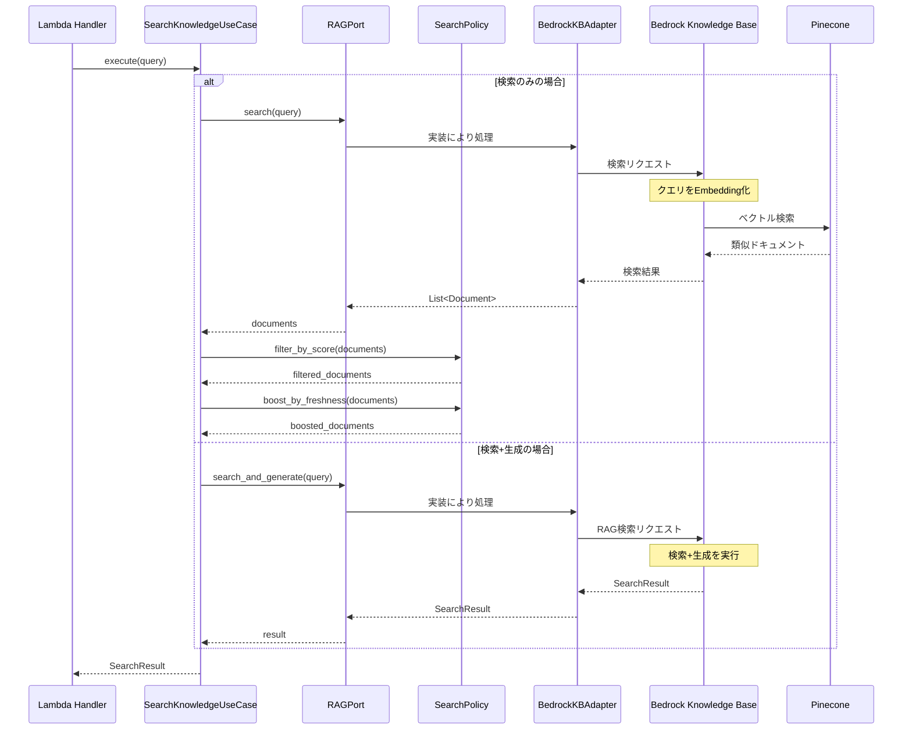
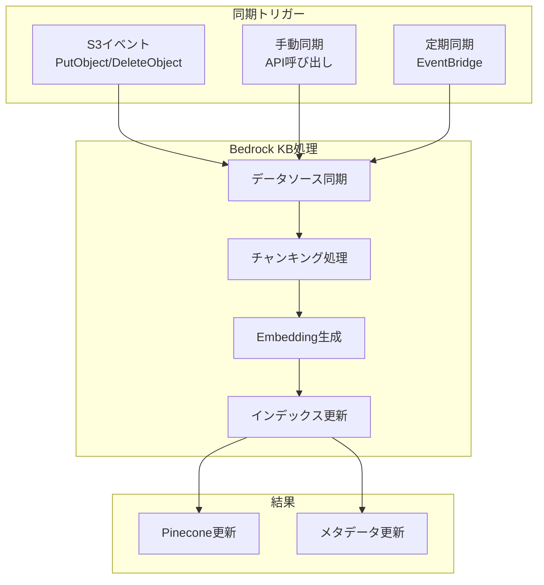

# Lambda Knowledge RAG System アーキテクチャ設計書

## 1. システム概要

### 1.1 目的

- Scrapboxで管理されているナレッジベースを、ベクトル検索可能なRAG（Retrieval-Augmented Generation）システムとして構築する
- AWS Lambdaを基盤として、AWS Bedrock Knowledge Baseを活用した知識の体系的な管理と高速な検索を実現する

### 1.2 主要機能

- Scrapboxプロジェクトからの知識抽出とS3への保存
- AWS Bedrock Knowledge Baseによる自動RAGパイプライン（Embedding生成、Pinecone管理を含む）
- ハイブリッド検索（セマンティック+キーワード）API
- 自動回答生成機能（オプション）
- MCPプロトコルによる各種LLMとの連携

### 1.3 Bedrock Knowledge Baseの役割

Bedrock Knowledge Baseは以下の処理を自動化する：

- **チャンキング**: ドキュメントの適切な分割とチャンク生成
- **Embedding生成**: 選択したモデル（Titan Embeddings等）による自動ベクトル化
- **Pinecone管理**: ベクトルデータベースへの自動インデックス作成と更新
- **メタデータ管理**: ドキュメントメタデータの自動抽出と管理
- **同期処理**: S3データソースからの自動同期

## 2. システムアーキテクチャ

### 2.1 全体構成

本システムは、MCPプロトコルを通じてLLMエージェントと連携し、Scrapboxのナレッジを取り込んでAWS Bedrock Knowledge Baseを活用したRAGシステムを構築する。

#### システム概要

1. **データ取り込み**: ScrapboxからのページデータをS3に保存
2. **自動処理**: Bedrock Knowledge BaseがEmbedding生成とPineconeインデックス作成を自動実行
3. **検索・生成**: ハイブリッド検索とLLMによる回答生成
4. **外部連携**: MCPプロトコルによる各種LLMとの統合



### 2.3 レイヤー構造



### 2.4 ディレクトリ構造

```
src/
├── domain/                 # ビジネスロジック層
│   ├── entities/          # エンティティ
│   ├── values/            # 値オブジェクト
│   └── policies/          # ドメインサービス
│
├── application/           # アプリケーション層
│   ├── usecases/         # ユースケース
│   └── ports/            # インターフェース定義
│
├── infrastructure/        # インフラストラクチャ層
│   ├── adapters/         # 外部システム連携
│   ├── lambda/           # Lambda関数
│   └── config/           # 設定・DI
│
└── shared/               # 共有コンポーネント
```

### 2.2 アーキテクチャ設計方針

#### クリーンアーキテクチャの採用

本システムでは、以下の理由からクリーンアーキテクチャを採用する：

- **変更への柔軟性**: 外部サービス（Scrapbox、AWS）の変更に対して、ビジネスロジックが影響を受けない
- **テスタビリティ**: ビジネスロジックを外部依存なしでテスト可能
- **責務の明確化**: 各層の責任範囲が明確で、保守性が向上する
- **依存関係の制御**: 内側の層が外側の層に依存しない単方向の依存関係を実現する

### 2.5 コンポーネント構成



### 2.6 主要インターフェース

アーキテクチャの重要な境界となるポート（インターフェース）を定義する：

#### ドメイン層

- **Document**: ナレッジベースの基本エンティティ
- **ScrapboxPage**: Scrapboxページのエンティティ
- **Query**: 検索クエリの値オブジェクト
- **SearchPolicy**: 検索ロジックのドメインサービス

#### アプリケーション層のポート

```
RAGPort
├── search(query): List<Document>
└── search_and_generate(query): SearchResult

StoragePort
├── save(document): void
├── find(document_id): Document
└── trigger_sync(): void

ScrapboxPort
├── list_pages(): List<dict>
└── get_page(title): ScrapboxPage
```

#### ユースケース

- **SearchKnowledgeUseCase**: 知識検索とフィルタリング
- **IngestScrapboxUseCase**: Scrapboxページの取り込み

#### インフラストラクチャ層

- **BedrockKBAdapter**: RAGPortの実装（Bedrock Knowledge Base連携）
- **S3Adapter**: StoragePortの実装（S3操作）
- **ScrapboxAdapter**: ScrapboxPortの実装（Scrapbox API連携）

## 3. データフロー設計

### 3.1 データ取り込み処理フロー



### 3.2 検索処理フロー



### 3.3 データ同期メカニズム



## 4. ドメインモデル定義

### 4.1 エンティティ

#### Document

- ナレッジベースの基本単位
- Scrapboxページから変換される
- S3に永続化され、Bedrock KBによって自動処理される

#### ScrapboxPage

- Scrapbox APIから取得される生データ
- Documentエンティティへの変換ロジックを持つ

### 4.2 値オブジェクト

#### DocumentId

- ドキュメントの一意識別子
- S3キーおよびBedrock KB内での識別に使用

#### Query

- 検索クエリを表現
- 検索モード（セマンティック/キーワード/ハイブリッド）を含む

#### Metadata

- ドキュメントのメタ情報
- ソース、作成日時、更新日時、タグなどを保持

### 4.3 ドメインポリシー

#### SearchPolicy

- 検索結果のフィルタリング戦略
- スコアリングとランキングのビジネスルール
- 重複排除ロジック

## 5. インフラストラクチャ設定

### 5.1 環境変数

| 変数名               | 説明                                  | 必須 |
|----------------------|---------------------------------------|------|
| `AWS_REGION`         | AWSリージョン                              | ○    |
| `SCRAPBOX_PROJECT`   | Scrapboxプロジェクト名                      | ○    |
| `SCRAPBOX_API_TOKEN` | Scrapbox APIトークン（Secrets Manager推奨） | ○    |
| `S3_BUCKET`          | Knowledge Base用S3バケット名              | ○    |
| `KNOWLEDGE_BASE_ID`  | Bedrock Knowledge BaseのID             | ○    |
| `DATA_SOURCE_ID`     | Bedrock KB内のデータソースID                 | ○    |

### 5.2 Bedrock Knowledge Base設定

#### データソース設定
- **タイプ**: S3
- **バケット**: `${S3_BUCKET}`
- **同期スケジュール**: リアルタイム（S3イベントトリガー）

#### Embedding設定
- **モデル**: Amazon Titan Embeddings G1 - Text
- **モデルID**: `amazon.titan-embed-text-v1`
- **次元数**: 1536

#### チャンキング戦略
- **方式**: 固定サイズチャンキング
- **チャンクサイズ**: 1000トークン
- **オーバーラップ**: 200トークン

#### ベクトルデータベース設定
- **プロバイダー**: Pinecone
- **接続**: Bedrock KB管理（APIキーはBedrock内で設定）
- **インデックス**: Bedrock KB管理下で自動作成
- **メトリクス**: コサイン類似度

#### 注意事項
- Embeddingの生成、Pineconeへのインデックス作成は全てBedrock KBが自動で実行
- Lambda側でのEmbedding処理やPinecone直接操作は不要
- Knowledge BaseのIAMロールはIaC(Terraform)で管理

## 6. セキュリティ設計

### 6.1 認証・認可

- Lambda関数の署名検証（HMAC-SHA256）
- IAMロールによる最小権限原則
- APIトークンのSecrets Manager管理
- Bedrock KBのリソースベースポリシー

### 6.2 データ保護

- S3暗号化（SSE-S3）
- 転送時のTLS暗号化
- ログのマスキング処理
- Pineconeへの接続はBedrock KB経由のみ

### 6.3 アクセス制御

- Bedrock KBへのアクセスはLambda実行ロール経由
- Pinecone APIキーはBedrock KB内で管理
- S3バケットポリシーによるアクセス制限
